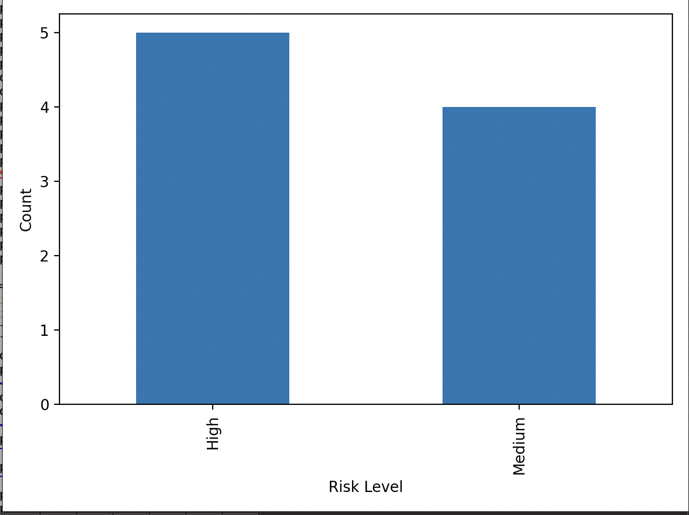

## 📊 Sample Output

## 🧠 What This Project Shows
- Identification of high-risk OB procedures
- Common denial patterns and root causes
- Modifier dependency insights
- Real-world coding workflow analysis

## 🛠️ Skills Demonstrated
- Python (pandas, matplotlib)
- Healthcare data analysis
- Revenue cycle insight
- Problem-solving using real claims scenarios
